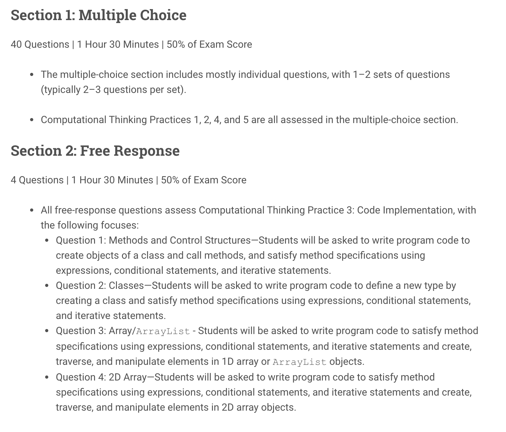
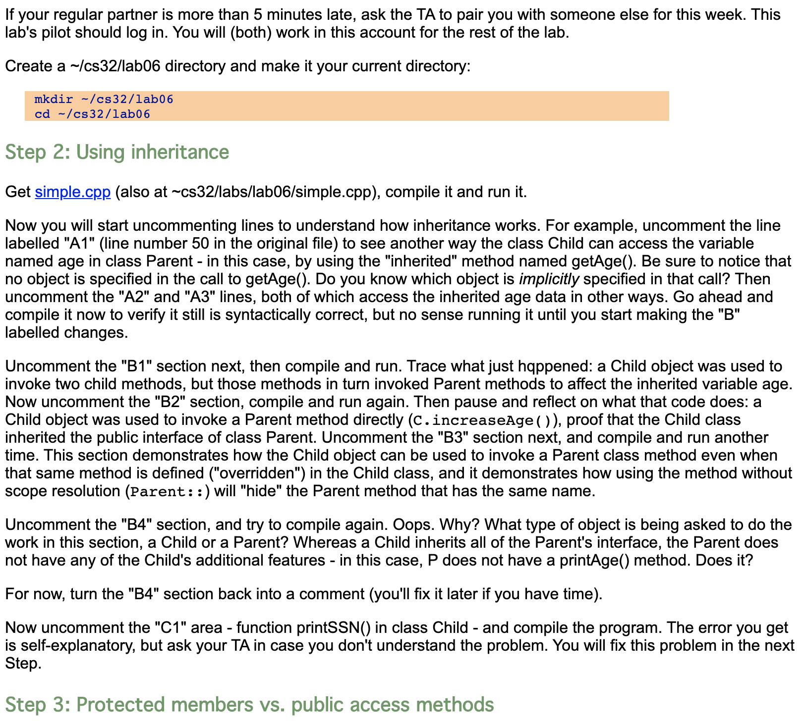
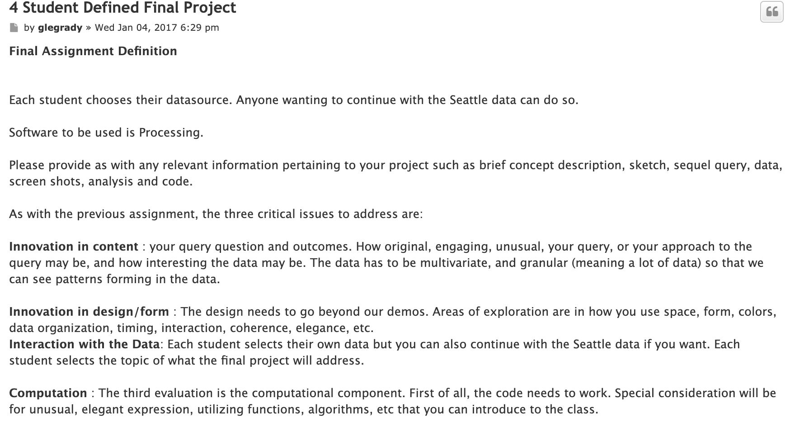

# Assignment 1 	

​	When I first learned how to program, I was taking AP Computer Science and my teacher was following the AP guidelines to prepare us for the test at the end of the year. I really wanted to take this course in high school because I had always been fascinated by computers and was interested in gaining insight into how computers work and what happens behind-the-scenes of the various software applications I was familiar with. Although, I was extremely interested in this, I did not particularly enjoy the structure of this class. We were constantly given generic AP test questions to solve, which gave little context to larger ideas about computer science, how one might apply these skills, and what careers might make use of this knowledge. It also did little to emphasize the creativity inherent to programming--although there are multiple solutions to these AP test questions, everyone in the class, who got it right, pretty much had the same code and approach. The problems required more skill in memorization than the development of creativity to implement fundamental concepts in interesting solutions.

​	I decided when starting undergraduate that even though I really enjoyed computer science, I did not want to pursue this path because I did not believe I would be able to experience the creative outlook I was looking for. Eventually though, after not really sure which path to take, I started taking computer science courses again. At first, I started taking similar classes as high school. My professors focused on topics such as optimization, storage, and algorithms. Again though, I constantly felt limitations of this narrow perspective. I could see how one could possibly use these tools I learned in class to create creative applications, but these classes did not allow us the possibility to use our knowledge and make something creative. The classes focused on concepts and problem sets, and never progressed beyond that framework. Also, when learning and understanding these concepts, it was extremely hard to visualize them; how is the computer actually storing and using memory? What about certain algorithms makes them much more efficient than others? These ideas and concepts were just facts that I memorized rather than really seeing and understanding the differences.

​	During this time, I learned about Media Art and Technology's Data Visualization course. I knew I had the coding experience, but when looking at projects from previous years, I did not understand how I could make the connection from my experience to the type of visualizations Professor Legrady was demonstrating. I jumped in anyway, and very quickly I was taking the simple techniques I learned in previous classes and making creative visualizations that were meaningful to me. It felt as if I had limitless ways of writing code to create these beautiful abstract pieces. I finally understood why I had that feeling of limited creativity in the previous courses. In this class, we were all using the same data, but there were infinite possibilities for how we could choose to visualize the information before us. I also realized that although I was using many of the concepts I had learned from the previous classes--such as for loops, lists, or if statements--I was definitely not focused on the optimization or memory storage. The focus was really being able to create something visually appealing in order to convey some sort of information and I was able to accomplish this without writing the most optimal algorithm. In some cases, I can understand how an inefficient approach to the code could create a very sluggish visualization, but at the same time there are many cases where it will not affect the outcome, so why waste your own efficiency when writing the code. 

​	Most of my programming classes have involved individual work, but over the summers I engaged in internships, which allowed me to work in team environments. Although in school, I am constantly collaborating with peers or professors, the work is usually my own work where I am using the resources around me. Within the work environment, I have always been creating something within the larger team project. Working as a software engineer at a startup company, I was usually in the same room as all of the engineers and everyday we would start the day off talking about the tasks we were working on the previous day and what we will be working on today. This made sure everyone was aware of each others goals and possibly be aware of who to reach out to if someone worked on a similar task before. The startup environment was extremely collaborative in this sense, but also we would have company wide "stand up" meetings once a week. This furthered collaborative work and opened up cross-disciplinary projects. This is possibly one of the reasons startups live in this fast pace environment of constantly growing and improving their product. I really enjoyed this experience and really appreciated the immediate gratification of constantly finishing projects and starting new ones. 
Last summer, I experienced the different type of culture and collaborative efforts that happen when part of a company of over 500 employees. The first extreme difference to me was that I was not in the same office or even the same hallway of most of the other people on my team. This then led to the possibility of not seeing my manager or other people on our team for days at a time. It was not that we would need to meet with our team daily in order to finish a project, but when we did meet it usually resulted in long meeting times as there was a lot to catch up on. Given my experience at the first startup, it seemed to me that more ideas or solutions could have been developed sooner if we were all constantly meeting and discussing our daily tasks in the way the startup did. This specific project we were working on took the whole summer to accomplish, which was in stark contrast to the pace of startup life and made me wonder if a more constant collaboration approach would have resulted in more efficient project timelines.

​	Having all of these experiences, I feel that I have been slowly transforming my programming experience to incorporate the best aspects of each. Most of the time when I find myself programming, no matter what the project consist of, I often find myself writing code that is not the most efficient. This is a great place for me to start, so that I can truly understand the tasks I am going to solve without focusing on the minor details. If I find it necessary, I will always be able to go back and replace it with a more optimized solution. I will most likely need to optimize when in the environment of an internship or more technical computer science class versus an artistic environment where the output will be more crucial and I probably will not need to waste time optimizing my output. This allows me to focus on the most interesting aspects of each project and possibly leave behind or save for later tasks that are less appealing to me. 

---

----

